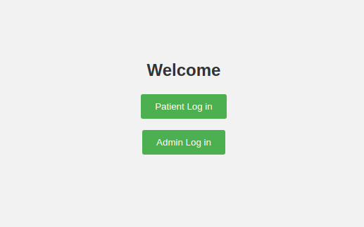
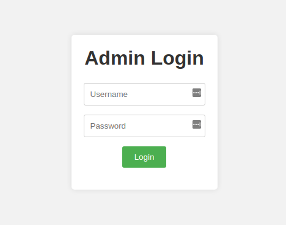
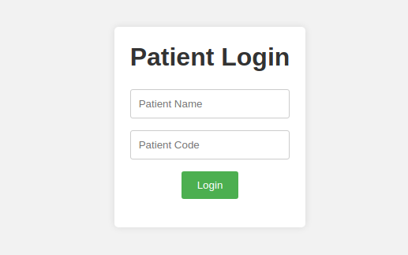
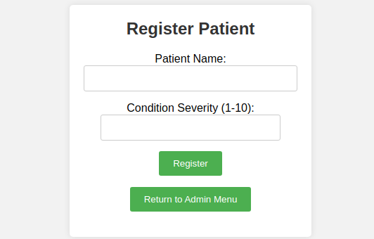
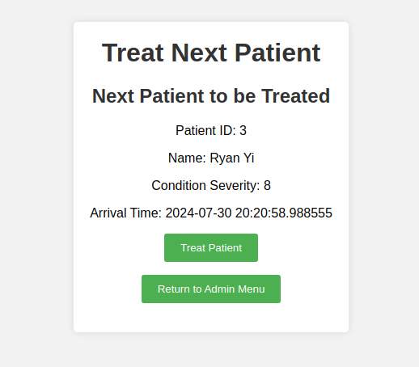
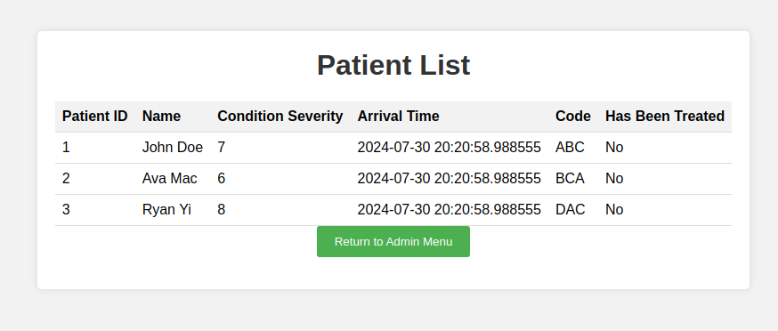
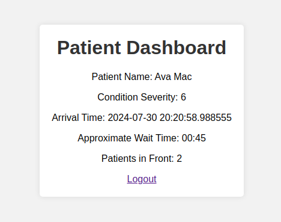

# Hospital Triage Application

This application simulates a hospital triage system, allowing staff members to register and treat patients based on the severity of their conditions.

## Architechture
The app is hosted using a php server. The php server processes the request and returns an appropriate HTML file (with embdedded CSS/JS)
The php server communicates with a locally hosted PostgreSQL database. 


## Features

- Register new patients with their name and condition severity (1-10)
- Treat the next patient in the queue
- View the current patient queue and list of treated patients
- Calculate approximate wait time for a patient based on their position in the queue

## Getting Started

1. Configure the `dbCreds.json` file with your database server credentials. This file should follow the JSON format:

```json
{
    "host": "localhost",
    "port": 5432,
    "db_name": "project",
    "db_username": "your_username",
    "db_password": "your_password"
}
```

# Instructions
Run `Main.php` to populate the database with dummy patient and staff data.

## Database Structure

DEFAULT PATIENTS:

    ('John Doe', 7, 'ABC', NOW(), FALSE),
    ('Ava Mac', 6, 'BCA', NOW(), FALSE),
    ('Ryan Yi', 8, 'DAC', NOW(), FALSE)

DEFAULT ADMINS/STAFF:

    ('John Smith', 'password123'),
    ('Jane Doe', 'securepassword'),
    ('Michael Johnson', 'admin123')


The database can be reset at any time by running `Main.php`.

Condition severity is rated on a scale of 1-10 (1 for least urgent, 10 for most urgent).

Wait time is approximated using the condition severity metric: 
`// Calculate the approximate wait time based on patients in front and their condition severity  
    $avgWaitTime = 0;  
    foreach ($patientsInFront as $severity) {  
    $avgWaitTime += $severity * 3; // Assuming each severity level adds 3 minutes of wait time}`.  

## Usage
Users are prompted to login either as an Admin or Patient.  


## Admin Login



## Patient Login


### Admin View
Staff members have access to the following functions:


- `registerPatient`: Adds a new patient using their name (String) and condition severity (int 1-10). Returns a 3-letter code for patient sign-in.


- `treatNextPatient`: Sends the next patient in the queue to an ER for treatment using their 3-letter code.


- `viewListPatient`: Shows the current queue and list of treated patients.


### Patient View
- `getWaitTime`: Calculates and returns the approximate wait time based on the position in the wait list, given the patient’s 3-letter code.


